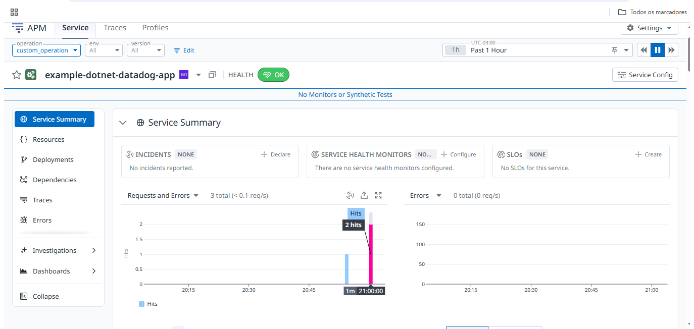

# .NET 10 + Datadog Docker Example

## Setup

1. Copy `.env.example` to `.env` and add your Datadog API key:
   ```bash
   cp .env.example .env
   # Edit .env with your DD_API_KEY
   ```

2. Build and run:
   ```bash
   docker-compose up --build
   ```

3. Test endpoints:
   - `http://localhost:8080/` - Health check
   - `http://localhost:8080/trace` - Generates a custom trace

## Datadog Features Enabled

- **APM Tracing**: Automatic ASP.NET Core + HttpClient instrumentation
- **Custom Traces**: Manual span creation in `/trace` endpoint
- **Log Injection**: Correlation IDs injected into logs
- **DogStatsD**: Metrics collection on port 8125
- **Serilog Integration**: Structured logging to Datadog

## Configuration

Environment variables:
- `DD_API_KEY` - Your Datadog API key (required)
- `DD_SERVICE` - Service name (default: my-dotnet-app)
- `DD_ENV` - Environment (default: development)
- `DD_VERSION` - App version (default: 1.0.0)

## Tests Done

